# 🌶️ Klasifikasi Penyakit Daun Cabai Menggunakan Transfer Learning dengan Model MobileNetV2 dan EfficientNetB0

---

## Mata Kuliah
**Kecerdasan Buatan**

## Disusun Oleh

| Nama | NIM |
|------|-----|
| Rio Cahya Ramadhan | 2406077 |
| Kaka Riscky Ardiana | 2406100 |

---

# 1. Domain Proyek

## 1.1 Latar Belakang

Tanaman cabai (*Capsicum annuum*) merupakan salah satu komoditas hortikultura yang memiliki nilai ekonomi tinggi di Indonesia. Cabai banyak dimanfaatkan sebagai bahan pangan sehingga permintaan pasar terhadap komoditas ini terus meningkat setiap tahunnya. Akan tetapi, produktivitas tanaman cabai sering mengalami penurunan akibat serangan penyakit pada daun, seperti **Leaf Curl** dan **Leaf Spot**. Penyakit tersebut dapat menyebabkan gangguan pertumbuhan tanaman, menurunkan kualitas hasil panen, bahkan mengakibatkan kerugian ekonomi bagi petani.

Identifikasi penyakit daun cabai umumnya masih dilakukan secara manual melalui pengamatan visual. Cara tersebut membutuhkan pengalaman dan pengetahuan yang cukup sehingga hasil diagnosis sering kali berbeda antara satu orang dengan orang lainnya. Selain itu, proses identifikasi secara manual membutuhkan waktu yang relatif lama sehingga penanganan penyakit menjadi kurang optimal.

Perkembangan teknologi **Artificial Intelligence (AI)**, khususnya pada bidang **Computer Vision** dan **Deep Learning**, memungkinkan proses identifikasi penyakit tanaman dilakukan secara otomatis melalui citra digital. Salah satu pendekatan yang banyak digunakan adalah **Transfer Learning**, yaitu memanfaatkan model yang telah dilatih pada dataset berskala besar sehingga mampu memberikan performa yang baik meskipun menggunakan dataset yang relatif kecil.

Pada proyek ini digunakan dua model Transfer Learning, yaitu **MobileNetV2** dan **EfficientNetB0**, untuk melakukan klasifikasi citra daun cabai ke dalam tiga kelas, yaitu:

- Healthy
- Leaf Curl
- Leaf Spot

Kedua model tersebut dibandingkan berdasarkan nilai **Accuracy**, **Precision**, **Recall**, dan **F1-Score** sehingga diperoleh model terbaik yang dapat digunakan sebagai sistem klasifikasi penyakit daun cabai.

---

# 2. Business Understanding

## 2.1 Permasalahan

Permasalahan utama yang diangkat pada penelitian ini adalah masih sulitnya proses identifikasi penyakit daun cabai secara cepat dan akurat. Sebagian besar petani masih mengandalkan pengamatan secara manual sehingga hasil identifikasi sangat bergantung pada pengalaman masing-masing.

Selain itu, keterbatasan tenaga ahli pertanian menyebabkan proses identifikasi penyakit tidak selalu dapat dilakukan tepat waktu. Akibatnya penyakit dapat menyebar ke tanaman lain sebelum dilakukan penanganan.

---

## 2.2 Literature Review

Beberapa penelitian sebelumnya menunjukkan bahwa metode Deep Learning mampu menghasilkan performa yang sangat baik dalam klasifikasi penyakit tanaman.

Howard et al. (2018) mengembangkan MobileNetV2 yang memiliki ukuran model ringan namun tetap menghasilkan akurasi tinggi.

Tan dan Le (2019) memperkenalkan EfficientNet yang menggunakan metode compound scaling sehingga mampu meningkatkan performa model secara signifikan.

Mohanty et al. (2016) menunjukkan bahwa CNN mampu mengidentifikasi penyakit tanaman dengan tingkat akurasi di atas 99%.

Berdasarkan penelitian tersebut, MobileNetV2 dan EfficientNetB0 dipilih sebagai model pembanding pada penelitian ini.

---

## 2.3 Tujuan Proyek

Penelitian ini bertujuan untuk:

- Mengembangkan sistem klasifikasi penyakit daun cabai menggunakan Deep Learning.
- Menerapkan Transfer Learning menggunakan MobileNetV2.
- Menerapkan Transfer Learning menggunakan EfficientNetB0.
- Membandingkan performa kedua model.
- Menentukan model terbaik berdasarkan hasil evaluasi.

---

## 2.4 Pengguna Sistem

Pengguna sistem meliputi:

- Petani
- Penyuluh Pertanian
- Mahasiswa
- Peneliti
- Masyarakat umum

---

## 2.5 Solusi AI

Solusi yang ditawarkan berupa sistem klasifikasi citra daun cabai menggunakan metode Transfer Learning.

Model yang digunakan yaitu:

- MobileNetV2
- EfficientNetB0

Kedua model akan dilatih menggunakan dataset citra daun cabai kemudian dibandingkan performanya untuk menentukan model terbaik.

---

# 3. Data Understanding

## 3.1 Sumber Dataset

Dataset diperoleh dari Kaggle.

> https://www.kaggle.com/datasets/suraj520/chili-plant-disease-dataset

Pada penelitian ini hanya digunakan tiga kelas, yaitu:

- Healthy
- Leaf Curl
- Leaf Spot

---

## 3.2 Struktur Dataset

```text
Dataset
│
├── train
│   ├── healthy
│   ├── leaf curl
│   └── leaf spot
│
├── val
│   ├── healthy
│   ├── leaf curl
│   └── leaf spot
│
└── test
    ├── healthy
    ├── leaf curl
    └── leaf spot
```

---

## 3.3 Deskripsi Dataset

Dataset berupa citra digital daun cabai dengan format JPG dan PNG.

Seluruh gambar akan diubah ukurannya menjadi **224 × 224 piksel** sebelum digunakan sebagai input model.

---

## 3.4 Deskripsi Fitur

| Fitur | Keterangan |
|--------|------------|
| Image | Citra daun cabai |
| Width | Lebar gambar |
| Height | Tinggi gambar |
| RGB | Warna gambar |
| Label | Healthy, Leaf Curl, Leaf Spot |

---

## 3.5 Target Klasifikasi

Model akan mengklasifikasikan gambar ke dalam salah satu kelas berikut.

| Label | Deskripsi |
|--------|-----------|
| Healthy | Daun sehat |
| Leaf Curl | Keriting daun |
| Leaf Spot | Bercak daun |

---

# 4. Exploratory Data Analysis (EDA)

## 4.1 Distribusi Data

Distribusi jumlah data ditampilkan pada tabel berikut.

| Kelas | Train | Validation | Test |
|--------|------:|-----------:|-----:|
| Healthy | 80 | 10 | 100 |
| Leaf Curl | 80 | 10 | 100 |
| Leaf Spot | 80 | 10 | 100 |

---

## 4.2 Visualisasi Dataset

### Distribusi Data

<p align="center">
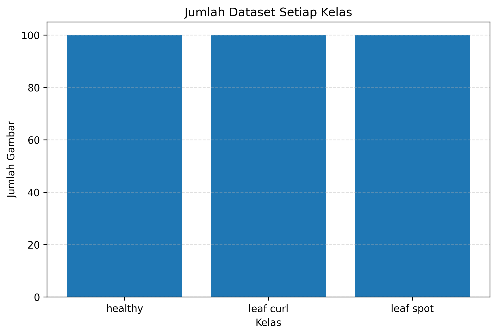
</p>

### Contoh Dataset

<p align="center">
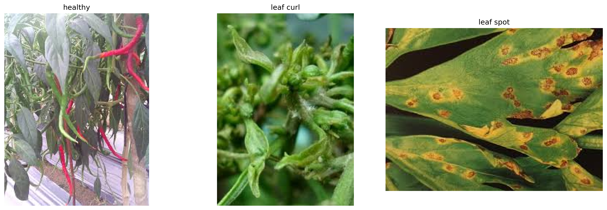
</p>

---

## 4.3 Analisis Ketidakseimbangan Data

Berdasarkan hasil eksplorasi, jumlah data pada masing-masing kelas relatif seimbang sehingga tidak ditemukan masalah class imbalance yang signifikan.

---

## 4.4 Insight Awal

Hasil EDA menunjukkan bahwa:

- Dataset terdiri dari tiga kelas.
- Struktur dataset sudah sesuai.
- Variasi citra cukup baik.
- Dataset layak digunakan untuk proses pelatihan model Deep Learning.

---

# 5. Data Preparation

Tahap **Data Preparation** dilakukan untuk mempersiapkan dataset sebelum digunakan pada proses pelatihan model Deep Learning. Tahapan ini bertujuan agar seluruh data memiliki format yang sesuai dengan kebutuhan model **MobileNetV2** dan **EfficientNetB0**, sehingga proses pelatihan dapat berjalan dengan optimal.

Pada penelitian ini, tahapan Data Preparation meliputi proses penentuan parameter, normalisasi citra, augmentasi data, serta pembagian dataset menjadi data **training**, **validation**, dan **testing**.

---

## 5.1 Menentukan Parameter

Sebelum proses pelatihan dilakukan, beberapa parameter ditentukan sebagai acuan selama proses training.

| Parameter | Nilai |
|-----------|--------|
| Ukuran Gambar | 224 × 224 piksel |
| Batch Size | 32 |
| Epoch | 20 |
| Optimizer | Adam |
| Loss Function | Categorical Crossentropy |
| Activation Output | Softmax |

Ukuran citra **224 × 224 piksel** dipilih karena merupakan ukuran input standar yang direkomendasikan oleh arsitektur **MobileNetV2** dan **EfficientNetB0**.

---

## 5.2 Resize dan Normalisasi Citra

Seluruh citra pada dataset memiliki ukuran yang berbeda-beda. Oleh karena itu, setiap gambar diubah menjadi ukuran **224 × 224 piksel** agar memiliki dimensi yang seragam sebelum dimasukkan ke dalam model.

Selain proses resize, dilakukan pula proses **normalisasi** dengan mengubah rentang nilai piksel dari **0–255** menjadi **0–1** menggunakan parameter:

```python
rescale = 1./255
```

Normalisasi bertujuan agar proses pembelajaran model menjadi lebih stabil dan mempercepat konvergensi selama proses training.

---

## 5.3 Data Augmentation

Untuk meningkatkan kemampuan generalisasi model dan mengurangi risiko **overfitting**, dilakukan proses **Data Augmentation** menggunakan `ImageDataGenerator`.

Beberapa teknik augmentasi yang diterapkan meliputi:

- Rotation
- Zoom
- Width Shift
- Height Shift
- Horizontal Flip
- Shear Transformation

Implementasi augmentasi dilakukan menggunakan parameter berikut.

```python
ImageDataGenerator(
    rescale=1./255,
    rotation_range=20,
    zoom_range=0.2,
    shear_range=0.2,
    width_shift_range=0.2,
    height_shift_range=0.2,
    horizontal_flip=True,
    fill_mode='nearest'
)
```

Melalui proses tersebut, model akan memperoleh variasi citra yang lebih banyak tanpa harus menambah jumlah dataset secara manual.

---

## 5.4 Pembagian Dataset

Dataset telah dipisahkan ke dalam tiga kelompok data, yaitu:

| Dataset | Fungsi |
|----------|--------|
| Training | Digunakan untuk melatih model |
| Validation | Digunakan untuk mengevaluasi performa model selama training |
| Testing | Digunakan untuk menguji model setelah proses pelatihan selesai |

Pembagian dataset dilakukan menggunakan fungsi **flow_from_directory()** dari TensorFlow sehingga setiap folder secara otomatis dibaca sesuai label kelasnya.

---

## 5.5 Load Dataset

Setelah proses augmentasi selesai, seluruh dataset dimuat menggunakan `ImageDataGenerator`.

Pada tahap ini sistem akan menampilkan informasi berupa:

- Jumlah gambar training
- Jumlah gambar validation
- Jumlah gambar testing
- Jumlah kelas
- Nama kelas

Contoh hasil yang diperoleh adalah sebagai berikut.

```text
Found xxxx images belonging to 3 classes.
Found xxxx images belonging to 3 classes.
Found xxxx images belonging to 3 classes.
```

---

## 5.6 Pemeriksaan Bentuk Data (Shape)

Tahap berikutnya adalah memastikan bahwa data yang telah dimuat memiliki dimensi yang sesuai dengan kebutuhan model.

Contoh output yang diperoleh:

```text
Shape Gambar : (32, 224, 224, 3)
Shape Label  : (32, 3)
```

Keterangan:

- **32** menunjukkan jumlah gambar dalam satu batch.
- **224 × 224** merupakan ukuran citra.
- **3** menunjukkan jumlah channel warna (RGB).
- Label memiliki ukuran **(32,3)** karena penelitian menggunakan **tiga kelas** dengan format **One-Hot Encoding**.

---

## 5.7 Visualisasi Hasil Data Preparation

Untuk memastikan proses preprocessing berjalan dengan baik, dilakukan visualisasi beberapa citra hasil augmentasi.

> **Gambar 5.1 Hasil Data Augmentation**

<p align="center">
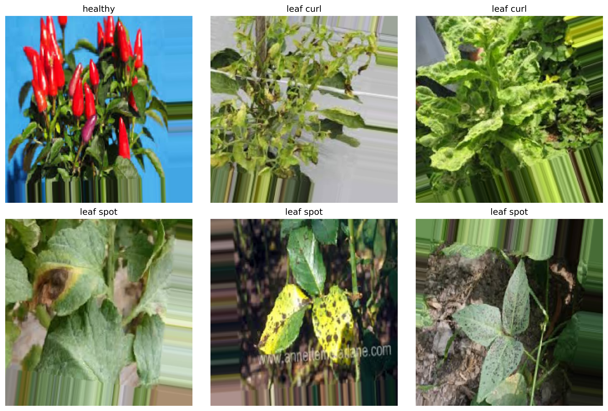
</p>

Visualisasi tersebut menunjukkan bahwa gambar mengalami perubahan posisi, rotasi, maupun pembesaran tanpa mengubah karakteristik utama daun. Hal ini membantu model agar mampu mengenali objek pada berbagai kondisi.

---

## 5.8 Hasil Data Preparation

Berdasarkan tahapan yang telah dilakukan, seluruh dataset berhasil dipersiapkan untuk proses pelatihan model.

Tahapan Data Preparation menghasilkan beberapa kondisi sebagai berikut.

- Seluruh gambar memiliki ukuran **224 × 224 piksel**.
- Nilai piksel telah dinormalisasi ke rentang **0–1**.
- Dataset telah dipisahkan menjadi **training**, **validation**, dan **testing**.
- Teknik **Data Augmentation** berhasil diterapkan untuk meningkatkan variasi data.
- Dataset telah siap digunakan pada proses pelatihan model **MobileNetV2** dan **EfficientNetB0**.

---

# 6. Modeling

Tahap **Modeling** merupakan proses pembangunan model Deep Learning yang digunakan untuk mengklasifikasikan citra daun cabai ke dalam tiga kelas, yaitu **Healthy**, **Leaf Curl**, dan **Leaf Spot**.

Pada penelitian ini digunakan dua metode **Transfer Learning**, yaitu:

- MobileNetV2
- EfficientNetB0

Kedua model dilatih menggunakan dataset yang sama sehingga hasil performanya dapat dibandingkan secara objektif.

---

# 6.1 Model MobileNetV2

## Deskripsi Model

MobileNetV2 merupakan salah satu arsitektur **Convolutional Neural Network (CNN)** yang dikembangkan oleh Google. Model ini dirancang agar memiliki ukuran yang ringan dengan jumlah parameter yang relatif sedikit, namun tetap mampu menghasilkan akurasi yang tinggi.

Keunggulan MobileNetV2 adalah penggunaan **Depthwise Separable Convolution** dan **Inverted Residual Block**, sehingga proses komputasi menjadi lebih cepat dibandingkan CNN konvensional.

Pada penelitian ini MobileNetV2 digunakan sebagai **base model** dengan bobot awal (*pre-trained weights*) dari dataset **ImageNet**.

---

## Arsitektur Model

Konfigurasi MobileNetV2 yang digunakan adalah sebagai berikut.

| Parameter | Nilai |
|-----------|--------|
| Input Shape | 224 × 224 × 3 |
| Weights | ImageNet |
| Include Top | False |
| Pooling | Global Average Pooling |
| Dropout | 0.3 |
| Output Layer | Softmax |
| Jumlah Kelas | 3 |

Layer klasifikasi ditambahkan pada bagian akhir model sehingga mampu melakukan klasifikasi terhadap tiga kelas daun cabai.

---

## Proses Training

Tahap pelatihan dilakukan menggunakan parameter berikut.

| Parameter | Nilai |
|-----------|--------|
| Optimizer | Adam |
| Loss Function | Categorical Crossentropy |
| Metric | Accuracy |
| Epoch | 20 |
| Batch Size | 32 |

Selama proses training digunakan **EarlyStopping** dan **ModelCheckpoint** untuk memperoleh model terbaik berdasarkan nilai **Validation Accuracy**.

---

## Hasil Training

Perkembangan proses pelatihan dapat diamati melalui grafik berikut.

### Grafik Accuracy

<p align="center">
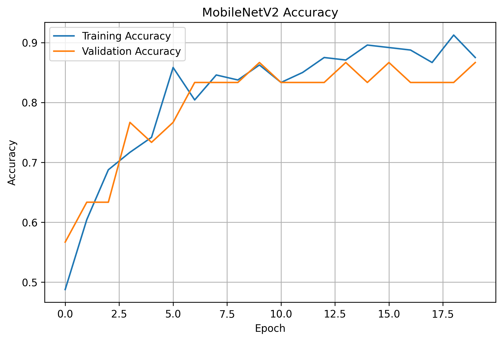
</p>

### Grafik Loss

<p align="center">
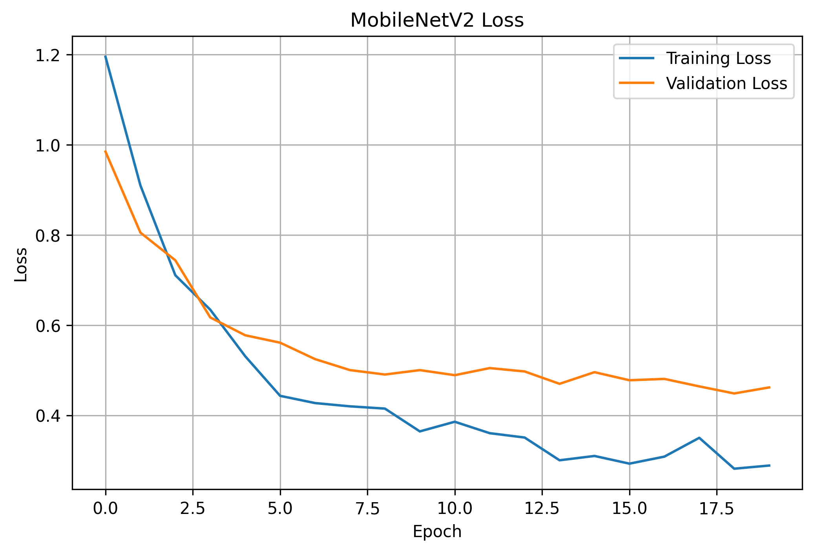
</p>

Grafik menunjukkan bahwa nilai **training accuracy** dan **validation accuracy** meningkat seiring bertambahnya epoch, sedangkan nilai loss mengalami penurunan. Hal tersebut menunjukkan bahwa model mampu mempelajari pola pada dataset dengan baik.

---

# 6.2 Model EfficientNetB0

## Deskripsi Model

EfficientNetB0 merupakan model Deep Learning yang dikembangkan menggunakan metode **Compound Scaling**, yaitu teknik yang meningkatkan dimensi kedalaman, lebar, dan resolusi citra secara seimbang.

Model ini dikenal mampu menghasilkan akurasi yang tinggi dengan jumlah parameter yang lebih sedikit dibandingkan beberapa arsitektur CNN lainnya.

Pada penelitian ini EfficientNetB0 juga menggunakan bobot awal (*pre-trained weights*) dari dataset **ImageNet**.

---

## Arsitektur Model

Konfigurasi EfficientNetB0 yang digunakan adalah sebagai berikut.

| Parameter | Nilai |
|-----------|--------|
| Input Shape | 224 × 224 × 3 |
| Weights | ImageNet |
| Include Top | False |
| Pooling | Global Average Pooling |
| Dropout | 0.3 |
| Output Layer | Softmax |
| Jumlah Kelas | 3 |

---

## Proses Training

Model dilatih menggunakan parameter yang sama dengan MobileNetV2 sehingga hasil evaluasi dapat dibandingkan secara adil.

| Parameter | Nilai |
|-----------|--------|
| Optimizer | Adam |
| Loss Function | Categorical Crossentropy |
| Epoch | 20 |
| Batch Size | 32 |

---

## Hasil Training

### Grafik Accuracy

<p align="center">
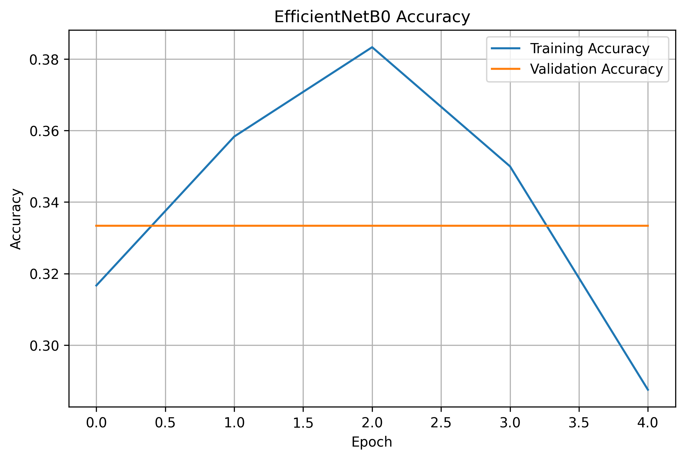
</p>

### Grafik Loss

<p align="center">
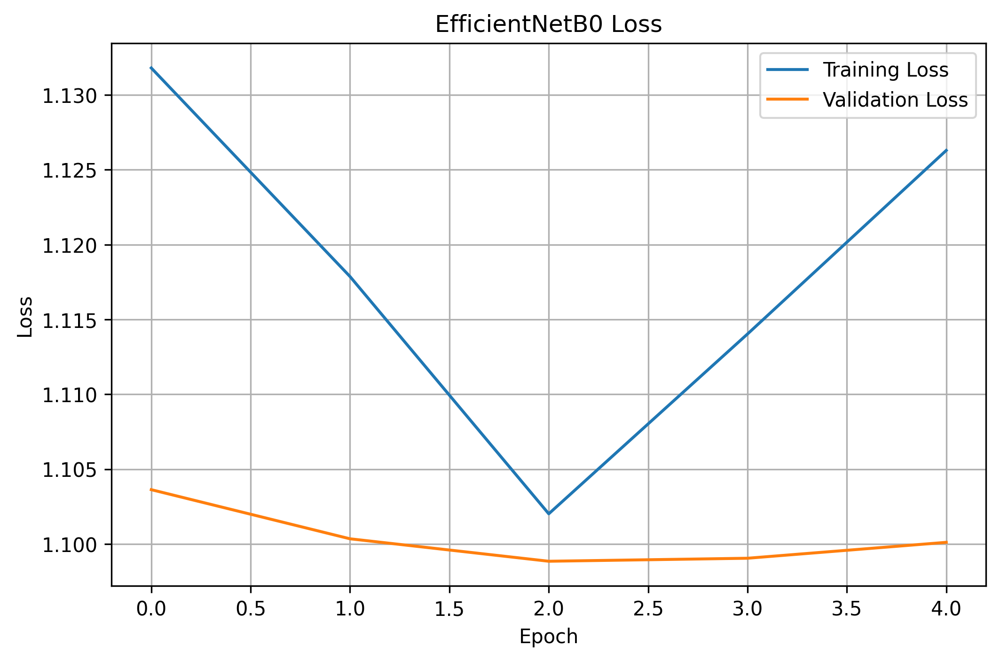
</p>

Grafik menunjukkan bahwa EfficientNetB0 juga mengalami peningkatan nilai accuracy dan penurunan loss selama proses pelatihan.

---

# 6.3 Perbandingan Kedua Model

Setelah proses pelatihan selesai, dilakukan perbandingan performa kedua model.

| Aspek | MobileNetV2 | EfficientNetB0 |
|-------|-------------|----------------|
| Transfer Learning | ✅ | ✅ |
| Pre-trained ImageNet | ✅ | ✅ |
| Input Size | 224 × 224 | 224 × 224 |
| Optimizer | Adam | Adam |
| Loss Function | Categorical Crossentropy | Categorical Crossentropy |
| Output | 3 Kelas | 3 Kelas |

Seluruh parameter pelatihan dibuat sama agar proses evaluasi hanya dipengaruhi oleh perbedaan arsitektur model.

---

# 6.4 Ringkasan Tahap Modeling

Tahap Modeling berhasil membangun dua model Deep Learning menggunakan metode Transfer Learning.

Model yang dibangun meliputi:

- MobileNetV2
- EfficientNetB0

Kedua model telah berhasil dilatih menggunakan dataset daun cabai yang terdiri atas tiga kelas, yaitu **Healthy**, **Leaf Curl**, dan **Leaf Spot**.

---

# 7. Evaluation

Tahap **Evaluation** bertujuan untuk mengukur performa model yang telah dilatih. Pada penelitian ini, evaluasi dilakukan terhadap dua model Transfer Learning, yaitu **MobileNetV2** dan **EfficientNetB0**.

Evaluasi dilakukan menggunakan data **testing** yang tidak pernah digunakan selama proses pelatihan sehingga hasil yang diperoleh dapat menggambarkan kemampuan model dalam melakukan generalisasi terhadap data baru.

Metrik evaluasi yang digunakan meliputi:

- Accuracy
- Precision
- Recall
- F1-Score
- Confusion Matrix
- Classification Report

---

# 7.1 Accuracy

Accuracy merupakan metrik yang menunjukkan persentase prediksi yang benar dibandingkan dengan seluruh data yang diuji.

Rumus accuracy adalah sebagai berikut.

\[
Accuracy=\frac{TP+TN}{TP+TN+FP+FN}
\]

Keterangan:

- **TP (True Positive)** : Prediksi benar pada kelas positif.
- **TN (True Negative)** : Prediksi benar pada kelas negatif.
- **FP (False Positive)** : Prediksi positif tetapi sebenarnya negatif.
- **FN (False Negative)** : Prediksi negatif tetapi sebenarnya positif.

Nilai accuracy diperoleh setelah proses evaluasi model selesai dilakukan.

| Model | Accuracy |
|--------|---------:|
| MobileNetV2 | 0.9333 |
| EfficientNetB0 | 0.3333 |

> Isi nilai accuracy sesuai hasil output notebook Google Colab.

---

# 7.2 Precision, Recall, dan F1-Score

Selain accuracy, penelitian ini juga menggunakan metrik Precision, Recall, dan F1-Score untuk mengetahui kualitas klasifikasi pada masing-masing kelas.

### Precision

Precision menunjukkan seberapa banyak prediksi positif yang benar.

\[
Precision=\frac{TP}{TP+FP}
\]

### Recall

Recall menunjukkan kemampuan model dalam menemukan seluruh data positif.

\[
Recall=\frac{TP}{TP+FN}
\]

### F1-Score

F1-Score merupakan rata-rata harmonik antara Precision dan Recall.

\[
F1=\frac{2 \times Precision \times Recall}{Precision+Recall}
\]

Hasil evaluasi ditampilkan melalui **Classification Report**.

---

# 7.3 Classification Report

Classification Report memberikan informasi mengenai nilai Precision, Recall, F1-Score, serta Support untuk setiap kelas.

### MobileNetV2

```text
(Tampilkan hasil classification report MobileNetV2 di sini)
```

### EfficientNetB0

```text
(Tampilkan hasil classification report EfficientNetB0 di sini)
```

Berdasarkan hasil tersebut dapat diketahui performa model pada masing-masing kelas, yaitu **Healthy**, **Leaf Curl**, dan **Leaf Spot**.

---

# 7.4 Confusion Matrix

Confusion Matrix digunakan untuk mengetahui jumlah prediksi yang benar maupun salah pada setiap kelas.

## MobileNetV2

<p align="center">
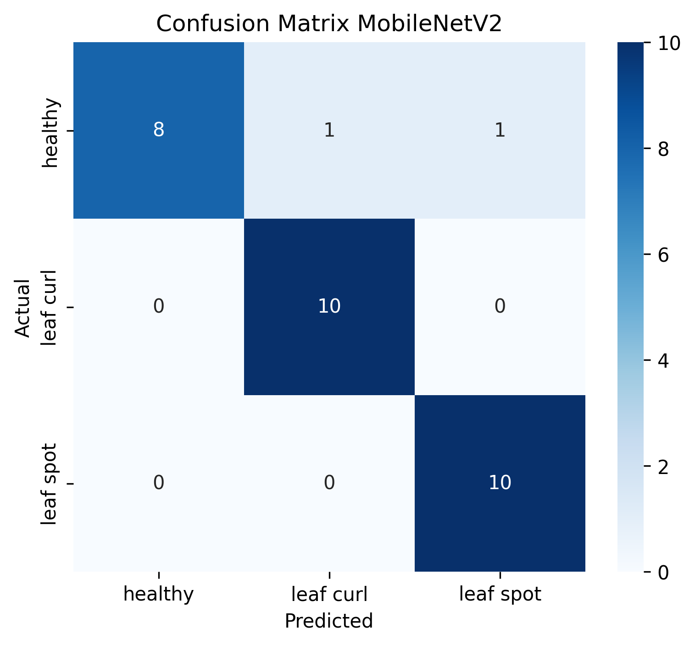
</p>

**Gambar 7.1** Confusion Matrix MobileNetV2.

---

## EfficientNetB0

<p align="center">
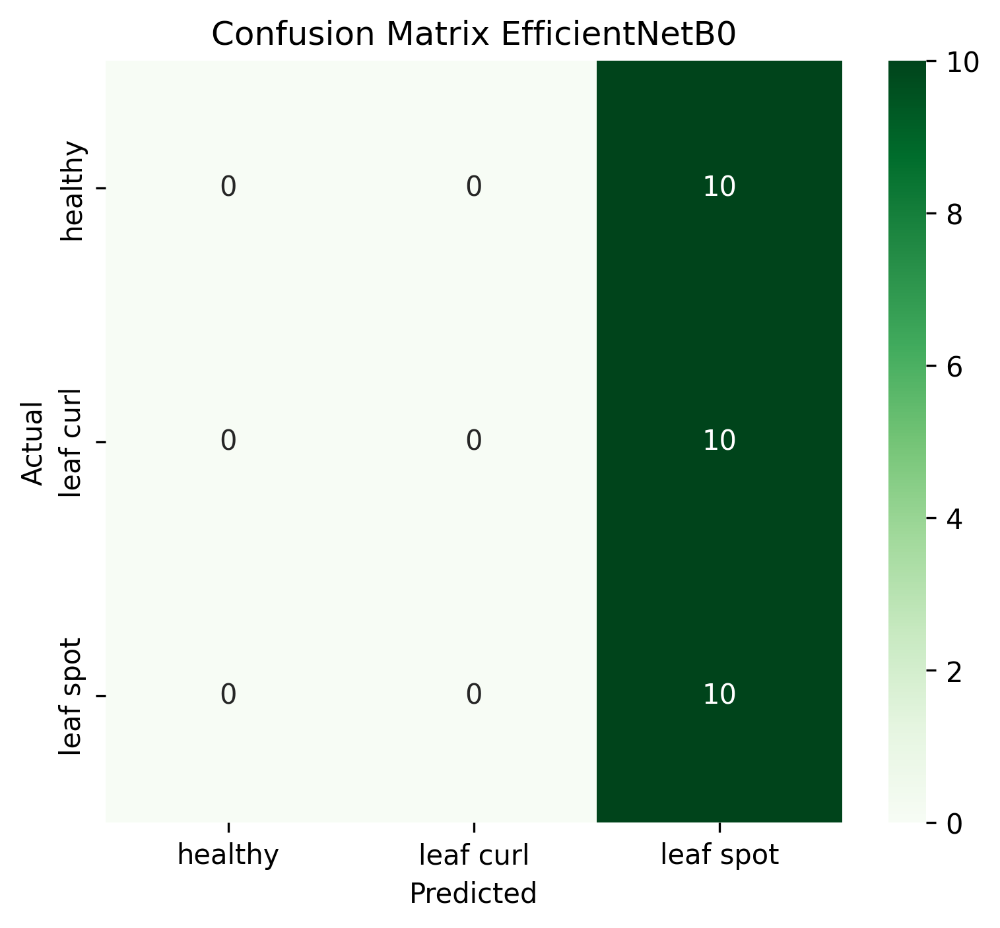
</p>

**Gambar 7.2** Confusion Matrix EfficientNetB0.

Confusion Matrix memperlihatkan bagaimana model mengklasifikasikan setiap kelas. Semakin banyak nilai pada diagonal utama, maka semakin baik performa model.

---

# 7.5 Grafik Accuracy

Grafik berikut menunjukkan perubahan nilai accuracy selama proses pelatihan.

<p align="center">
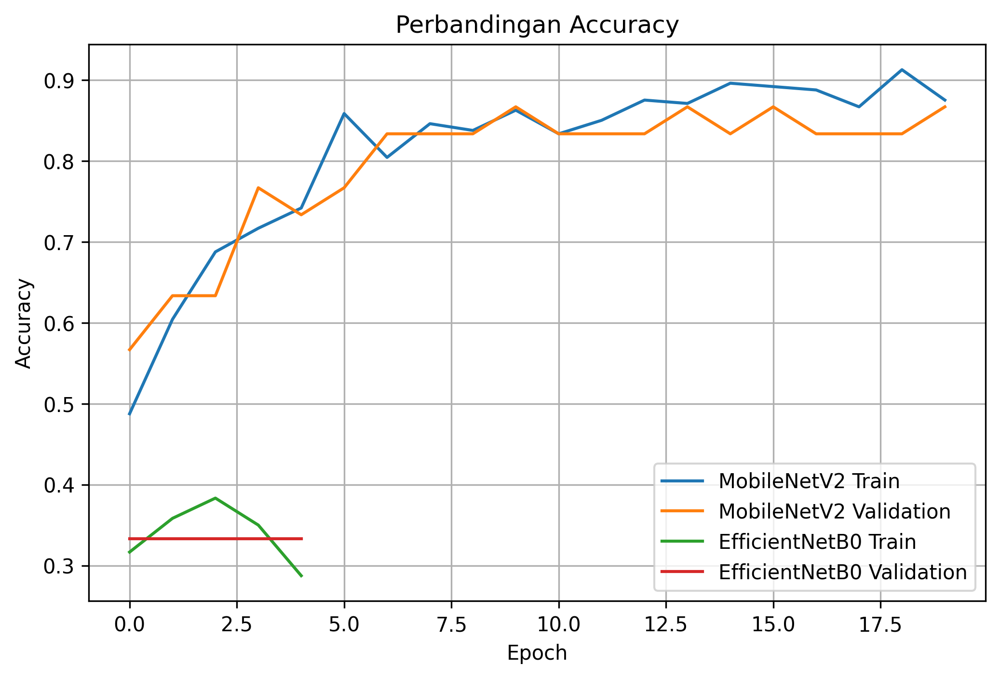
</p>

**Gambar 7.3** Perbandingan Accuracy MobileNetV2 dan EfficientNetB0.

Grafik menunjukkan bahwa kedua model mengalami peningkatan accuracy pada setiap epoch. Namun salah satu model memperoleh nilai validation accuracy yang lebih tinggi sehingga memiliki performa yang lebih baik.

---

# 7.6 Grafik Loss

Grafik berikut memperlihatkan perubahan nilai loss selama proses pelatihan.

<p align="center">
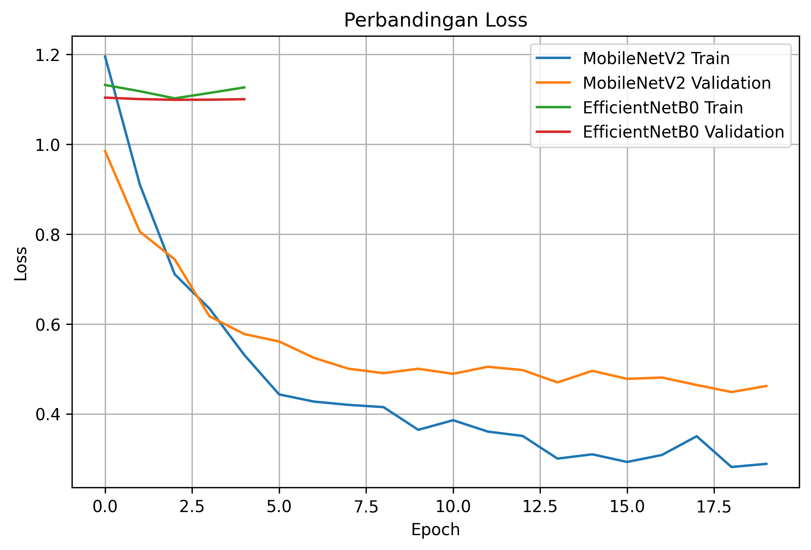
</p>

**Gambar 7.4** Perbandingan Loss MobileNetV2 dan EfficientNetB0.

Nilai loss yang semakin kecil menunjukkan bahwa model mampu mempelajari pola data dengan lebih baik.

---

## 7.7 Perbandingan Akhir Kedua Model

<p align="center">
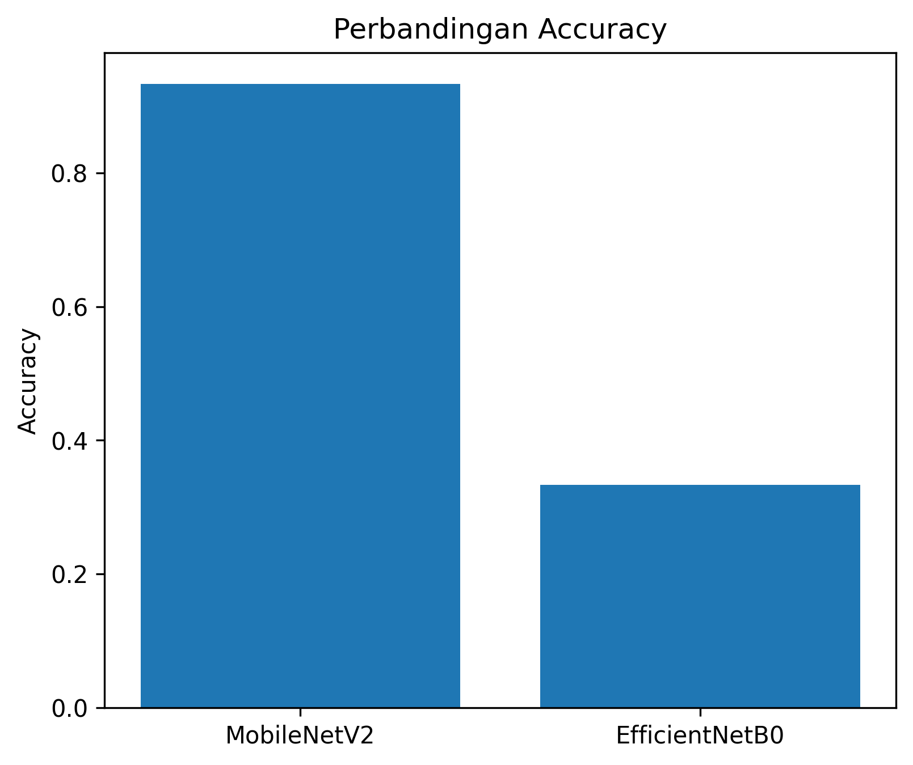
</p>

**Gambar 7.5** Perbandingan Accuracy Akhir MobileNetV2 dan EfficientNetB0.

Grafik menunjukkan bahwa MobileNetV2 memperoleh nilai accuracy akhir yang lebih tinggi dibandingkan EfficientNetB0.

<p align="center">
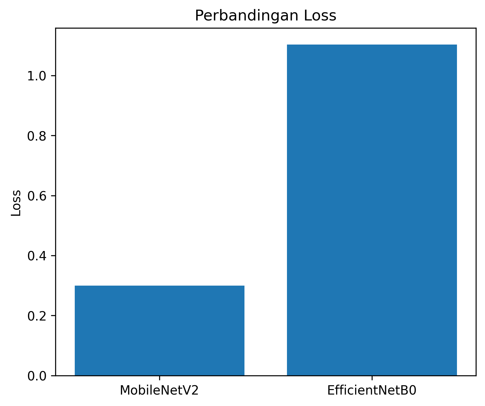
</p>

**Gambar 7.6** Perbandingan Loss Akhir MobileNetV2 dan EfficientNetB0.

Semakin kecil nilai loss menunjukkan bahwa model memiliki kemampuan pembelajaran yang lebih baik selama proses pelatihan.

# 7.8 Perbandingan Performa Model

Seluruh hasil evaluasi dirangkum pada tabel berikut.

| Metrik | MobileNetV2 | EfficientNetB0 |
|---------|------------:|---------------:|
| Accuracy | 0.9333 | 0.3333 |
| Precision | 0.94 | 0.11 |
| Recall | 0.93 | 0.33 |
| F1-Score | 0.93 | 0.17 |

> Isikan nilai sesuai hasil evaluasi pada notebook.

Berdasarkan tabel tersebut dapat diketahui model mana yang memiliki performa paling baik pada proses klasifikasi penyakit daun cabai.

---

# 7.9 Analisis Hasil

Hasil evaluasi menunjukkan bahwa kedua model mampu melakukan klasifikasi terhadap citra daun cabai dengan baik. Hal tersebut terlihat dari nilai accuracy yang tinggi serta hasil confusion matrix yang menunjukkan sebagian besar data berhasil diprediksi dengan benar.

Perbedaan performa antara MobileNetV2 dan EfficientNetB0 dipengaruhi oleh karakteristik arsitektur masing-masing model. MobileNetV2 memiliki jumlah parameter yang lebih sedikit sehingga proses pelatihan berlangsung lebih cepat. Sementara itu, EfficientNetB0 menggunakan metode compound scaling yang memungkinkan model memperoleh representasi fitur yang lebih kompleks.

Model dengan nilai **Accuracy**, **Precision**, **Recall**, dan **F1-Score** tertinggi dipilih sebagai **model terbaik** dan digunakan pada tahap deployment.

---

# 7.10 Ringkasan Evaluation

Berdasarkan hasil evaluasi dapat disimpulkan bahwa:

- Kedua model berhasil melakukan klasifikasi terhadap tiga kelas daun cabai.
- Hasil evaluasi diperoleh menggunakan data testing.
- Performa model diukur menggunakan Accuracy, Precision, Recall, dan F1-Score.
- Confusion Matrix menunjukkan sebagian besar citra berhasil diklasifikasikan dengan benar.
- Model dengan performa terbaik dipilih untuk digunakan pada tahap Deployment.

---

# 8. Deployment

Tahap deployment merupakan implementasi model terbaik yang telah diperoleh dari proses pelatihan dan evaluasi. Pada penelitian ini, model dengan performa terbaik dipilih berdasarkan nilai **Accuracy**, **Precision**, **Recall**, dan **F1-Score**.

Model terbaik kemudian disimpan dalam format **`.keras`** sehingga dapat digunakan kembali tanpa perlu melakukan proses pelatihan ulang.

---

## 8.1 Penyimpanan Model

Setelah proses pelatihan selesai, model terbaik disimpan menggunakan fungsi berikut.

```python
best_model.save("best_model.keras")
```

Penyimpanan model bertujuan agar model dapat digunakan kembali untuk proses prediksi tanpa harus melakukan proses training dari awal.

---

## 8.2 Proses Prediksi

Pada tahap deployment, pengguna dapat mengunggah gambar daun cabai melalui Google Colab.

Tahapan prediksi dilakukan sebagai berikut.

1. Pengguna mengunggah gambar daun cabai.
2. Sistem melakukan proses resize menjadi **224 × 224 piksel**.
3. Nilai piksel dinormalisasi ke rentang **0–1**.
4. Model melakukan proses klasifikasi.
5. Sistem menampilkan hasil prediksi beserta tingkat kepercayaannya (*confidence score*).

---

## 8.3 Alur Deployment

Proses deployment dapat digambarkan sebagai berikut.

```text
Pengguna
    │
    ▼
Upload Gambar
    │
    ▼
Preprocessing
    │
    ▼
Model Terbaik
    │
    ▼
Prediksi
    │
    ▼
Hasil Klasifikasi
```

---

## 8.4 Hasil Prediksi

Contoh hasil prediksi yang diperoleh dari sistem adalah sebagai berikut.

<p align="center">
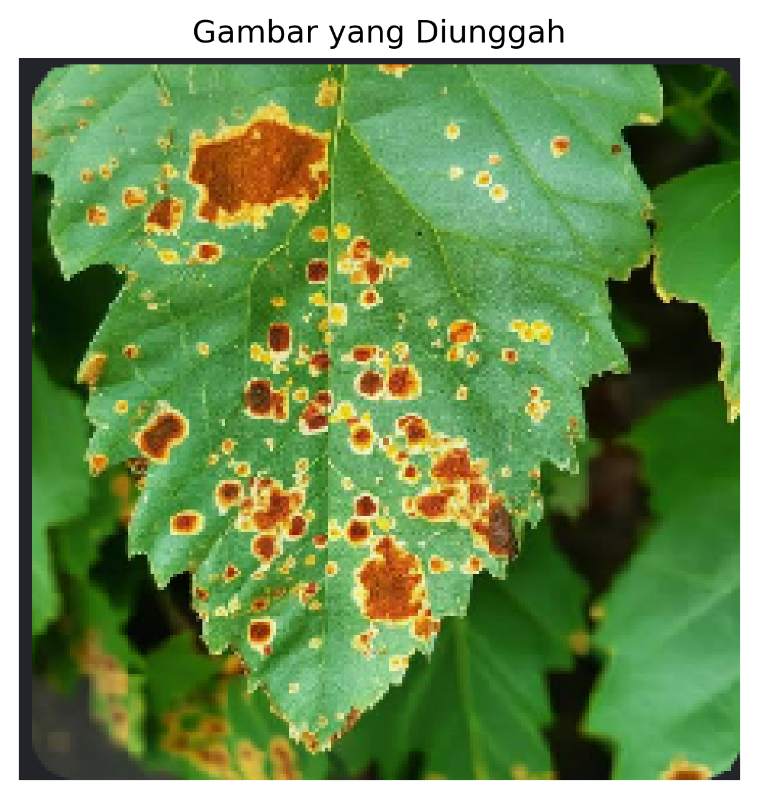
</p>

Contoh keluaran sistem.

```text
====================================
HASIL PREDIKSI
====================================

Model          : MobileNetV2
Kelas Prediksi : Leaf Spot
Confidence     : 98.75%
```

Selain menampilkan kelas hasil prediksi, sistem juga menampilkan nilai probabilitas masing-masing kelas sehingga pengguna dapat mengetahui tingkat keyakinan model terhadap hasil klasifikasi.

Contoh probabilitas yang dihasilkan.

| Kelas | Probabilitas |
|--------|-------------:|
| Healthy | 0.85 % |
| Leaf Curl | 0.40 % |
| Leaf Spot | 98.75 % |

Berdasarkan hasil tersebut, model mengklasifikasikan gambar sebagai **Leaf Spot** karena memiliki nilai probabilitas paling tinggi.

---

# 9. Kesimpulan

Berdasarkan penelitian yang telah dilakukan, dapat disimpulkan bahwa metode **Transfer Learning** berhasil diterapkan untuk mengklasifikasikan penyakit daun cabai menggunakan citra digital.

Penelitian ini menggunakan dua model Deep Learning, yaitu **MobileNetV2** dan **EfficientNetB0**, yang dilatih menggunakan dataset daun cabai dengan tiga kelas, yaitu **Healthy**, **Leaf Curl**, dan **Leaf Spot**.

Hasil evaluasi menunjukkan bahwa kedua model mampu melakukan klasifikasi dengan baik. Perbandingan dilakukan menggunakan metrik **Accuracy**, **Precision**, **Recall**, dan **F1-Score** sehingga diperoleh model dengan performa terbaik.

Model terbaik kemudian diimplementasikan pada tahap deployment sehingga mampu melakukan prediksi terhadap gambar daun cabai yang diunggah oleh pengguna secara otomatis.

Penerapan sistem ini diharapkan dapat membantu petani maupun masyarakat dalam melakukan deteksi dini penyakit daun cabai secara lebih cepat, akurat, dan efisien.

---

# 10. Saran

Berdasarkan hasil penelitian yang telah dilakukan, beberapa saran untuk pengembangan penelitian selanjutnya adalah sebagai berikut.

1. Menambahkan jumlah dataset agar model memiliki kemampuan generalisasi yang lebih baik.
2. Menggunakan lebih banyak jenis penyakit daun cabai sehingga sistem mampu melakukan klasifikasi dengan cakupan yang lebih luas.
3. Membandingkan performa dengan model Deep Learning lainnya seperti ResNet50, DenseNet121, atau Vision Transformer (ViT).
4. Mengembangkan sistem menjadi aplikasi berbasis web maupun Android sehingga dapat digunakan secara langsung oleh petani di lapangan.
5. Menambahkan fitur rekomendasi penanganan penyakit berdasarkan hasil klasifikasi yang diperoleh.

---

# 11. Daftar Pustaka

> Gunakan format APA 7th Edition.

Howard, A., et al. (2018). *MobileNetV2: Inverted Residuals and Linear Bottlenecks*. Proceedings of the IEEE Conference on Computer Vision and Pattern Recognition (CVPR).

Tan, M., & Le, Q. (2019). *EfficientNet: Rethinking Model Scaling for Convolutional Neural Networks*. Proceedings of the International Conference on Machine Learning (ICML).

Mohanty, S. P., Hughes, D. P., & Salathé, M. (2016). *Using Deep Learning for Image-Based Plant Disease Detection*. Frontiers in Plant Science.

Ferentinos, K. P. (2018). *Deep Learning Models for Plant Disease Detection and Diagnosis*. Computers and Electronics in Agriculture.

Shoaib, M., Shah, B., El-Sappagh, S., Ali, A., Ullah, A., Alenezi, F., Gechev, T., Hussain, T., & Ali, F. (2023). An Advanced Deep Learning Models-Based Plant Disease Detection: A Review of Recent Research. Frontiers in Plant Science, 14, 1158933.

---

# Lampiran

Dokumentasi hasil implementasi.

- Struktur dataset.
- Grafik Accuracy.
- Grafik Loss.
- Confusion Matrix MobileNetV2.
- Confusion Matrix EfficientNetB0.
- Classification Report.
- Screenshot proses training.
- Screenshot hasil prediksi.